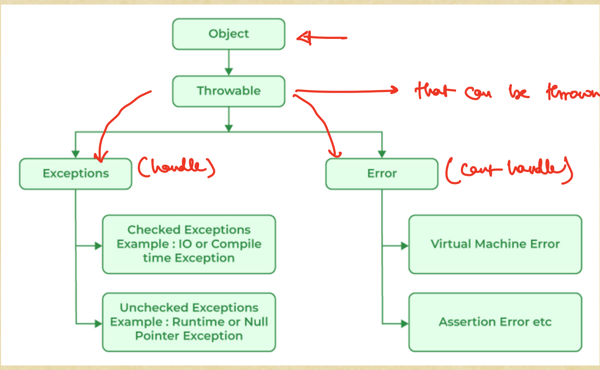

# Lecture | Backend LLD: Java Advanced Concepts - 4 [Exception Handling and Miscellaneous Topics]

# Deepak Kasera sir:

## I] Introduction to Exceptions
- An exception is an event that disrupts the normal flow of a program/code execution. When an exceptional situation occurs, 
  an object representing the exception (i.e. of Exception class) is thrown. Exception handling allows you to 
  catch and handle these exceptions, preventing your program from crashing.
- When an exception occurs, then the code doesn't execute further. It is disrupted then and there.

---

## II] Exception Hierarchy:

1. `Throwable` is the parent class of `Exception` and `Error` classes. `Exception` is thrown when it occurs. 
   Exceptions can be handled in the `method` where they have occurred, or they can be passed to the `Caller` method.
   However, Errors cannot be handled.
2. There are two classes namely `Exception` and `Error` which directly extend the `Throwable` class.
3. There are a bunch of Exceptions which directly extend `Exception` class. They are `I/O Exception` which occurs when
   incorrect or not-suitable input is fed, or `SQL Exception` or `ClassCastException`, or `FileNotFoundException` etc. 
   However, there is a category of Exceptions called as `Runtime Exceptions` which extends `Exception` class. 
   And then `ArrayIndexOutOfBoundException`, `ArithmeticException`, `NullPointerException` ,etc. 
   These exceptions directly  don't extend `Exception` class rather they extend `Runtime Exceptions` directly. 
4. In `Error` class, there are different types of classes which extends it, as `StackOverflowError` or `OutOfMemoryError` or
   `VirtualMachineError` , etc.
5. We can very well say one thing that all the Runtime exceptions can be avoided if developers write the code correctly.
   Say, 
```java
int a , b;
if(b!=0) System.out.println(a/b);
// here we avoided `ArithmeticException`.
for(int i =0; i<array.length; i++)  a += array[i];
//here we avoided `ArrayIndexOutOfBoundException` by accessing array elements within the array limits.
```

### 2.1) Checked Exception:
- These are checked at compile-time, and the programmer is required to handle them explicitly using `try-catch` blocks 
  or declare them in the method signature using the `throws` keyword(i.e. pass to the parent) .
- Checked exceptions extend the `Exception` class (directly or indirectly) but do not extend RuntimeException.
- They are enforced to compile-time checking by the Java compiler, meaning the compiler ensures that these exceptions
  are either caught or declared/thrown.
- Some common examples of checked exceptions include:
  - `IOException`
  - `SQLException`
  - `ClassNotFoundException`
  - `InterruptedException`

### 2.2) UnChecked Exception:
- These are not checked at compile-time, and they are subclasses of `RuntimeException`. They usually indicate programming
  errors, and it's not mandatory to handle them explicitly. Hence, the compiler doesn't enforce us to handle or pass the exception to the parent class.
- *Unchecked exceptions*, also known as *runtime exceptions*, are exceptions that occur during the execution of a program.
- Unchecked exceptions can occur at runtime due to unexpected conditions, such as division by zero, 
  accessing an array index out of bounds, or trying to cast an object to an incompatible type.
- Some common examples of unchecked exceptions include:
    1. `ArithmeticException`: Occurs when an arithmetic operation encounters an exceptional condition, such as division by zero.
    2. `NullPointerException`: Occurs when trying to access a member (field or method) on an `object` that is `null`.
    3. `ArrayIndexOutOfBoundsException`: Occurs when trying to access an array element with an index that is outside the bounds of the array.
    4. `ClassCastException`: Occurs when attempting to cast an object to a type that is not compatible with its actual type.

The main point is if we handle our Exceptions, then the code doesn't break. It is obvious that if we don't handle our code then 
code will surely break. This is true for any type of code.

### 2.3) Errors:
- If any errors happen, then the program cannot come back from it just like it did by handling or passing the exceptions. Here, we just have to restart the application.
- Look, if `StackOverflowError` occurs, then there is no Stack memory left. So, the program cannot run further. 
  Similarly, if `OutOfMemoryError` occurs then there is no Java memory, hence we just need to restart the application.
- These represent serious problems that are typically beyond the control of the application and should generally not be caught or handled by the program itself.

---

## III] Exception Handling:
In Java, if an exception is not handled, the stack trace (including the exception type, message, and the call stack) will be exposed to the user in the following scenarios:
1. Unhandled Exceptions in a Console Application:- If the application is a command-line program, the JVM will print the full stack trace to the console before terminating.
2. Unhandled Exceptions in a Web Application (Servlet/Spring):- If the exception propagates up to the container (e.g., Tomcat, Jetty), the server may expose the stack trace 
   in the HTTP response (depending on server configuration).
3. Unhandled Exceptions in a Desktop Application (Swing/JavaFX):- 
   - If the exception occurs on the main GUI thread, the application might crash, and the stack trace may be printed to the console or a system log.
   - Some frameworks (like JavaFX) may suppress it by default, but it can still be exposed in logs.
So, all in all, we don't want all of these to happen. Hence, we need to handle the exceptions gracefully.
We don't want users to just see the `Something went wrong` error flashing on their screens. Rather, we want a meaningful message to the client.
Say, at Scaler, learners are trying to book the mentor slot at the time when mentor is unavailable then they should get the specific custom message,
like `Choose different time slot as your mentor isn't present at this time.` This is, what is called as *Exception Handling*.
- Note: Remember, `throws` keyword is not used to handle the exceptions. It is used to just pass the exception to the parent method.

### 3.1) Using `try-catch` block:

1. **Purpose of `try-catch`**
    - The `try-catch` block is used to **handle exceptions** gracefully, preventing the program from crashing and allowing controlled error recovery.

2. **Structure**
    - **`try` block**: Contains the **suspected code** that might throw an exception.
    - **`catch` block**: Defines how to **handle the exception** if it occurs.
        - Inside the parentheses, you specify:
            - The **type of exception** (e.g., `ArithmeticException`, `IOException`).
            - A **variable name** (commonly `e`) to access the exception object.

3. **How It Works**
    - If an exception occurs in the `try` block, Java **stops the remaining execution** inside `try` and **checks** the `catch` blocks in order.
    - The **first matching `catch` block** is executed if the exception type of catch block matches or is a superclass
      otherwise the next `catch` block is checked for matching.
    - If **no matching `catch` block** is found, the exception **propagates up** the call stack (possibly crashing the program).
    - Once the `catch` block finishes handling the exception, the program continues execution after the `try-catch` block.

4. **Example**
   ```java
   try {
       int result = 10 / 0; // Throws ArithmeticException
   } catch (ArithmeticException e) {
       System.out.println("Error: Division by zero"); // Handled
   } catch (Exception e) {
       System.out.println("Generic error: " + e.getMessage()); // Fallback
   }
   ```
    - If `ArithmeticException` occurs, the first `catch` runs.
    - For other exceptions, the second `catch` (generic) runs.


5. **Multiple catch Blocks:-**
- You can have multiple catch blocks to handle different types of exceptions that may occur within the try block.
```java
try {
    // Code that might throw an exception
    // ...
} catch (ExceptionType1 e1) {
    // Code to handle ExceptionType1
    // ...
} catch (ExceptionType2 e2) {
    // Code to handle ExceptionType2
    // ...
}
```
- Example: This example shouldn't be deleted and must be read.
```java
public class MultipleCatchExample {
    public static void main(String[] args) {
        try {
            String str = null;
            System.out.println(str.length()); // This may throw a NullPointerException
        } catch (ArithmeticException e) {
            System.out.println("ArithmeticException: " + e.getMessage());
            e.printStackTrace(); // this line will print the stack trace which is helpful while debugging
        } catch (NullPointerException e) {
            System.out.println("NullPointerException: " + e.getMessage());
        } catch (Exception e) {
            System.out.println("Generic Exception: " + e.getMessage());
        }catch (NullPointerException | ArrayIndexOutOfBoundsException e) {
            //here, in this way, we can match two or more exception in the same catch block, if we need to handle them in the same way.
            System.out.println("NullPointerException/ArrayIndexOutOfBoundsException: " + e.getMessage());
        }
    }
}
```
Here, if the `try` block throws `ArithmeticException` then the first `catch` block is executed. However, if it throws `IOException`,
then third `catch` block will be executed as we know for a long time that object of child class can be referenced by the parent class.
Since, third `catch` block has exception type `Exception`, which is the parent of all the exceptions hence it catches all other generic exceptions.
But, if this 3rd catch block had been the first block or the only block, then all the exceptions would have been caught there.
But, in that case, all the exceptions would be handled in the same way. But, we can have a need to handle different exceptions differently
and hence we use different `catch` blocks. And hence we always use the generic catch block(third in above example) as the last catch block.

```java
public class MultipleCatchExample {
    public static void main(String[] args) {
        try {
            String str = null;
            System.out.println(str.length()); // This may throw a NullPointerException
        } catch (Exception e) {
            System.out.println("Generic Exception: " + e.getMessage());
        } catch (ArithmeticException e) {
            System.out.println("ArithmeticException: " + e.getMessage());
        } catch (NullPointerException e) {
            System.out.println("NullPointerException: " + e.getMessage());
        } 
    }
}
```
In this case, only the first `catch` block will get executed. Hence, we should always place it as the last `catch` block.
This generic `catch` block must be written because, as the developers, we can miss some edge cases which may give some other
exception which our `catch` blocks don't match in that case the generic `catch` block will handle the exception.
However, the above code won't compile as the last two `catch` blocks are unreachable statements.
- NOTE: While you don't directly "throw a Throwable object" in the sense of creating a generic `Throwable` object and throwing it, 
        you do throw instances of its subclasses. 

--- 

**NOTE:** Read `ExceptionClient.java` file first then go ahead.

---

## IV] `finally` block:

1. It is optional and not the mandatory block. It is used at the final stage after the try-catch block.
2. The `finally` block in Java is used to define code that must be executed whether an exception is thrown or not. 
   It's part of Java's exception handling mechanism and works with `try-catch` blocks.

### Key Characteristics:

1. **Always Executes**: The `finally` block runs regardless of whether:
    - The `try` block completes successfully
    - An exception occurs and is caught
    - An exception occurs and is not caught
    - There's a `return` statement in the `try` or `catch` blocks
    - i.e. in all the scenarios.

2. **Optional**: A `try` block must have either `catch` blocks or a `finally` block, or both.

3. **Single `finally` per `try`**: There can be only one `finally` block for each `try` block.

### Syntax:

```java
try {
    // Code that might throw an exception
} catch (ExceptionType e) {
    // Exception handler
} finally {
    // Code that always executes
}
```

### Example:

```java
public class FinallyExample {
    public static void main(String[] args) {
        try {
            int result = 10 / 2; // This could throw ArithmeticException
            System.out.println("Result: " + result);
        } catch (ArithmeticException e) {
            System.out.println("Cannot divide by zero");
        } finally {
            System.out.println("This will always execute");
        }
    }
}
```

### Common Use Cases:

1. **Resource cleanup**: Closing files, database connections, or network sockets
   Say, we are creating the Database connection. Now, irrespective of whatever happens, i.e. code executes, it doesn't execute, 
   exception happens, not happens, we would always want to close the Database. Such type of code, which we always want to be 
   executed, comes in the `finally` block.
   ```java
   FileInputStream file = null;
   try {
       file = new FileInputStream("example.txt");
       // Process the file
   } catch (IOException e) {
       e.printStackTrace();
   } finally {
       if (file != null) {
           try {
               file.close();
           } catch (IOException e) {
               e.printStackTrace();
           }
       }
   }
   ```

2. **Releasing system resources**
3. **Logging completion of operations**

### Important Notes:

- In modern Java (7+), try-with-resources is generally preferred over `finally` for resource cleanup
- If the JVM exits (via `System.exit()`) in the `try` or `catch` block, the `finally` block won't execute
- If a `return` statement exists in `finally`, it will override any `return` in `try` or `catch`

The `finally` block ensures critical cleanup code runs, making your programs more robust and preventing resource leaks.

---

## V] # Runtime Exception Propagation in Java:

**Runtime exceptions (unchecked exceptions) are automatically propagated upwards** through the call stack until they're either:

1. Caught by a `catch` block that handles that exception type (or one of its superclasses), **or**
2. Reach the top of the call stack (causing the thread to terminate if uncaught)

## Key Characteristics of Runtime Exception Propagation:

1. **No mandatory handling**: Unlike checked exceptions, you're not required to:
    - Declare them in `throws` clauses
    - Wrap them in try-catch blocks

**Remember:** While runtime exceptions propagate automatically, it's often good practice to catch them at appropriate layers rather than letting them bubble all the way up.

---

## Assignment:

### Q.1) 
1. The `try-with-resources` statement is used to automatically close resources (like files or sockets) after they are no longer needed. 
   It ensures that the resources are closed in a reliable manner, even if an exception occurs.

### Q.2)
2. Consider below block of code:
```java
public class ThreadExample {
    public static void main(String[] args) {
        Thread thread = new Thread(new Runnable() {
            @Override
            public void run() {
                try {
                    Thread.sleep(5000);
                    System.out.println("Task completed.");
                } catch (InterruptedException e) {
                    System.out.println("Thread interrupted while sleeping.");
                }
            }
        });


        thread.start();


        try {
            Thread.sleep(10000);
            thread.interrupt();
        } catch (InterruptedException e) {
            e.printStackTrace();
        }
    }
}
/*
        Guess the output

option A) Task completed

option B)  Thread interrupted while sleeping.

option C)  Compilation Error

option D) RunTime Error
 */
```
Let's analyze the code step by step to determine the correct output:

#### Code Execution Flow:
1. A new thread is created and started (`thread.start()`).
2. The **main thread** sleeps for 10 seconds (`Thread.sleep(10000)`). Learning: In whatever Thread, we call this `sleep` property, that particular thread sleeps.
3. The **worker thread** (created thread) sleeps for 5 seconds (`Thread.sleep(5000)`).
4. After 5 seconds, the worker thread wakes up and prints **"Task completed."**.
5. After 10 seconds, the main thread wakes up and calls `thread.interrupt()`, but by this time:
    - The worker thread has **already completed** its task (since it only took 5 seconds).
    - Interrupting a **terminated thread has no effect**.

#### Key Observations:
- The worker thread **finishes before** the main thread attempts to interrupt it.
- `interrupt()` only affects a thread if it's **active** (e.g., sleeping, waiting). Here, the worker thread is already done.
- No exceptions or errors occur.

#### Output:
The worker thread prints:  
**"Task completed."**  
The `interrupt()` call has no effect because the thread is already finished.

#### Why Other Options Are Incorrect:
- **B) "Thread interrupted while sleeping."**  
  Wrong because the thread isn't sleeping when interrupted (it already completed).
- **C) "Compilation Error"**  
  Wrong because the code compiles fine.
- **D) "Runtime Error"**  
  Wrong because no exception is thrown (the thread terminates normally).

#### Correct Answer:
✅ **A) "Task completed."**

#### Additional Note:
1. If the main thread's sleep time was **shorter** than the worker thread's (e.g., `Thread.sleep(2000)`), then `interrupt()` would interrupt the worker thread 
   during its sleep, and option B would be correct. But in this case, the worker finishes first.
2. To understand more about Thread interruption, read it.

### Q.3)
1. If an exception is thrown inside the catch-block and that exception is not caught, the catch-block is interrupted just like the try-block would have been.
   i.e.The exception propagates up the call stack (possibly crashing the program if uncaught).
2. 
